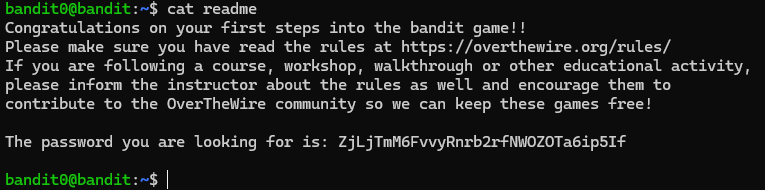
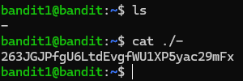
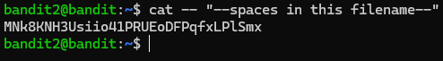
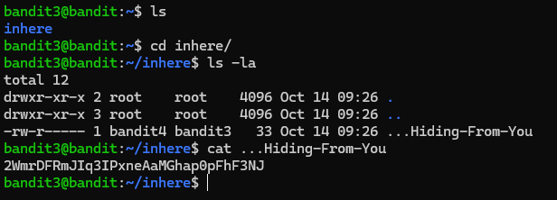
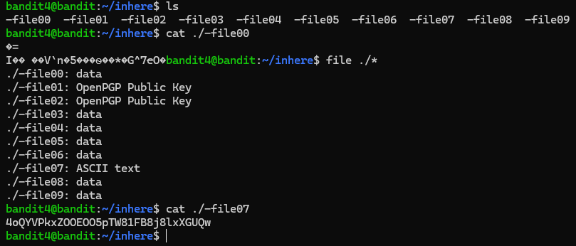
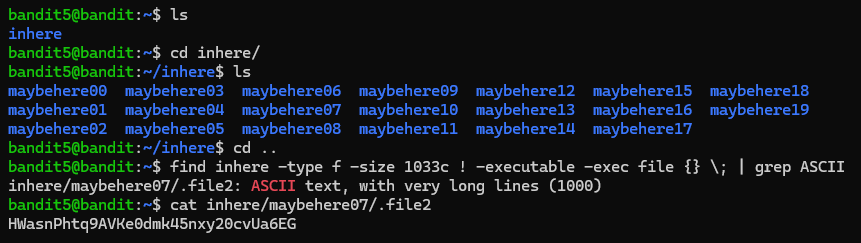
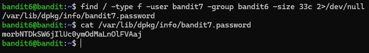
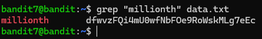
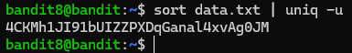
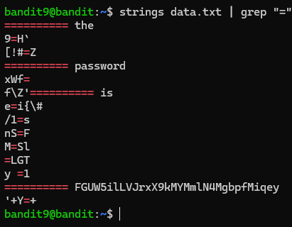

# OverTheWire Bandit


---

##  Introduction

**OverTheWire: Bandit** is a wargame designed to teach the basics of security and hacking through a series of progressive challenges. Each level requires finding a password to access the next level, teaching fundamental Linux commands, file manipulation, and security concepts along the way.

Completed the *OverTheWire Bandit* wargame to strengthen my Linux command-line skills and filesystem navigation.
Solved progressively challenging levels involving *shell commands*, *file manipulation*, *permissions*, and *text processing.*

This writeup documents everything on how I did it (Level 0 through Level 33), providing commands, explanations, and visual references for each challenge.

> **Official Site:** [https://overthewire.org/wargames/bandit/](https://overthewire.org/wargames/bandit/)  


---

##  Table of Contents

- [Level 0 → Level 1](#level-0--level-1)
- [Level 1 → Level 2](#level-1--level-2)
- [Level 2 → Level 3](#level-2--level-3)
- [Level 3 → Level 4](#level-3--level-4)
- [Level 4 → Level 5](#level-4--level-5)
- [Level 5 → Level 6](#level-5--level-6)
- [Level 6 → Level 7](#level-6--level-7)
- [Level 7 → Level 8](#level-7--level-8)
- [Level 8 → Level 9](#level-8--level-9)
- [Level 9 → Level 10](#level-9--level-10)
- [Level 10 → Level 11](#level-10--level-11)
- [Level 11 → Level 12](#level-11--level-12)
- [Level 12 → Level 13](#level-12--level-13)
- [Level 13 → Level 14](#level-13--level-14)
- [Level 14 → Level 15](#level-14--level-15)
- [Level 15 → Level 16](#level-15--level-16)
- [Level 16 → Level 17](#level-16--level-17)
- [Level 17 → Level 18](#level-17--level-18)
- [Level 18 → Level 19](#level-18--level-19)
- [Level 19 → Level 20](#level-19--level-20)
- [Level 20 → Level 21](#level-20--level-21)
- [Level 21 → Level 22](#level-21--level-22)
- [Level 22 → Level 23](#level-22--level-23)
- [Level 23 → Level 24](#level-23--level-24)
- [Level 24 → Level 25](#level-24--level-25)
- [Level 25 → Level 26](#level-25--level-26)
- [Level 26 → Level 27](#level-26--level-27)
- [Level 27 → Level 28](#level-27--level-28)
- [Level 28 → Level 29](#level-28--level-29)
- [Level 29 → Level 30](#level-29--level-30)
- [Level 30 → Level 31](#level-30--level-31)
- [Level 31 → Level 32](#level-31--level-32)
- [Level 32 → Level 33](#level-32--level-33)
- [Level 33 → Level 34](#level-33--level-34)

---

## Level 0 → Level 1

### Level Info

> The password for the next level is stored in a file called **readme** located in the home directory. Use this password to log into bandit1 using SSH. 
> Whenever you find a password for a level, use SSH (on port 2220) to log into that level and continue the game.

---
### Commands

```bash
ssh bandit0@bandit.labs.overthewire.org -p 2220
password:bandit0
cat readme
```


> **Password:** ############################
### Explanation

>Just read the file using cat.
>I'm not supposed to publish the password. hash represents the pass
### Into the next!

```bash
ssh bandit1@bandit.labs.overthewire.org -p 2220
```

```bash
#################################
```

---

## Level 1 → Level 2

### Level Info

>The password for the next level is stored in a file called **"-"** located in the home directory
---
### Commands

```bash
cat ./-
```



> **Password:** ##############

### Explanation

>The file is literally named **`-`**, but in Linux `-` usually means **standard input (stdin)**.
> Using **`./-`** forces the system to treat it as a **filename**.

### Into the next!

```bash
ssh bandit2@bandit.labs.overthewire.org -p 2220
```

```bash
#################################
```

---

## Level 2 → Level 3

### Level Info

>The password for the next level is stored in a file called **-** located in the home directory
---
### Commands

```bash
cat -- "--spaces in this filename--"
```



> **Password:** #################################

### Explanation

>The filename contains spaces, so it must be quoted.
> Since it also starts with `--`, the `--` argument is required to stop option parsing.

### Into the next!

```bash
ssh bandit3@bandit.labs.overthewire.org -p 2220
```

```bash
########################################
```

---

## Level 3 → Level 4

### Level Info

>The password for the next level is stored in a hidden file in the **inhere** directory.

---

### Commands

```bash
ls
cd inhere
ls -la
cat ...Hiding-From-You
```



> **Password:** ##################################

### Explanation

>Files that start with `.` are hidden by default in Linux.  
>Using `ls -la` reveals hidden files, allowing the password file to be identified and read.

### Into the next!

```bash
ssh bandit4@bandit.labs.overthewire.org -p 2220
```

```bash
#################################
```

---

## Level 4 → Level 5

### Level Info

>The password for the next level is stored in the only human-readable file in the **inhere** directory.
>Tip: if your terminal is messed up, try the “reset” command.

---

### Commands

```bash
ls
cat ./-file00
file ./*
cat ./-file07
```



> **Password:** ########################

### Explanation

>Most files in the directory are binary.  
>Using file type inspection helps identify the single file containing readable text with the password.

### Into the next!

```bash
ssh bandit5@bandit.labs.overthewire.org -p 2220
```

```bash
##################################
```

---

## Level 5 → Level 6

### Level Info

>The password for the next level is stored in a file somewhere under the **inhere** directory and has all of the following properties:

- human-readable
- 1033 bytes in size
- not executable

---

### Commands

```bash
ls
cd inhere/
ls
cd ..
find inhere -type f -size 1033c ! -executable -exec file {} \; | grep ASCII
cat inhere/maybehere07/.file2
```



> **Password:** #################################

### Explanation


>The challenge requires finding a file under the *inhere* directory that is human‑readable, exactly 1033 bytes in size, and not executable.

>`find inhere` searches recursively inside the *inhere* directory.  
>`-type f` restricts the search to regular files only.  
>`-size 1033c` filters files that are exactly 1033 bytes.  
>`! -executable` excludes files with execute permissions.  
>`-exec file {} \;` runs the `file` command on each matching file to identify its type.  
>`grep ASCII` filters the output to show only human‑readable (ASCII) files.

>This combination isolates the single file containing the password.

### Into the next!

```bash
ssh bandit6@bandit.labs.overthewire.org -p 2220
```

```bash
########################################
```

---

## Level 6 → Level 7

### Level Info

>The password for the next level is stored **somewhere on the server** and has all of the following properties:

- owned by user bandit7
- owned by group bandit6
- 33 bytes in size

---

### Commands

```bash
find / -type f -user bandit7 -group bandit6 -size 33c 2>/dev/null
```



> **Password:** ###########################

### Explanation

>The challenge requires locating a file anywhere on the system that matches specific ownership and size properties.

>`find /` searches the entire filesystem.  
>`-type f` limits the search to regular files.  
>`-user bandit7` filters files owned by the user *bandit7*.  
>`-group bandit6` filters files owned by the group *bandit6*.  
>`-size 33c` selects files that are exactly 33 bytes in size.  
>`2>/dev/null` suppresses permission denied errors during the search.

>This combination uniquely identifies the file containing the password.

### Into the next!

```bash
ssh bandit7@bandit.labs.overthewire.org -p 2220
```

```bash
##########################################
```

---

## Level 7 → Level 8

### Level Info

>The password for the next level is stored in the file **data.txt** next to the word **millionth**

---

### Commands

```bash
grep "millionth" data.txt
```



> **Password:** ################################

### Explanation

>The password is located on the same line as the word *millionth*.  
>Using `grep` searches the file and returns the matching line containing the password.

### Into the next!

```bash
ssh bandit8@bandit.labs.overthewire.org -p 2220
```

```bash
########################################
```

---

## Level 8 → Level 9

### Level Info

>The password for the next level is stored in the file **data.txt** and is the only line of text that occurs only once

---

### Commands

```bash
sort data.txt | uniq -u
```



> **Password:** ##############################

### Explanation


>The file contains many repeated lines, with only one line occurring once.  
>Sorting the file groups identical lines, allowing `uniq -u` to identify and display the unique line.

### Into the next!

```bash
ssh bandit9@bandit.labs.overthewire.org -p 2220
```

```bash
#########################################
```

---

## Level 9 → Level 10

### Level Info

>The password for the next level is stored in the file **data.txt** in one of the few human-readable strings, preceded by several ‘=’ characters.

---

### Commands

```bash
strings data.txt | grep "="
```



> **Password:** ################################

### Explanation

>The file contains binary data with a few human‑readable strings.  
>The `strings` command extracts readable text, and `grep "="` filters the lines preceded by `=` to reveal the password.

### Into the next!

```bash
ssh bandit10@bandit.labs.overthewire.org -p 2220
```

```bash
################################
```

---

## Level 10 → Level 11

### Level Info

>The password for the next level is stored in the file **data.txt**, which contains base64 encoded data

---

### Commands

```bash
base64 -d data.txt
```


> **Password:** dtR173fZKb0RRsDFSGsg2RWnpNVj3qRr

### Explanation

>The file contains data encoded in Base64 format.  
>Using `base64 -d` decodes the content, revealing the original text which contains the password.

### Into the next!

```bash
ssh bandit11@bandit.labs.overthewire.org -p 2220
```

```bash
dtR173fZKb0RRsDFSGsg2RWnpNVj3qRr
```

---

## Level 11 → Level 12

### Level Info

>The password for the next level is stored in the file **data.txt**, where all lowercase (a-z) and uppercase (A-Z) letters have been rotated by 13 positions

---

### Commands

```bash
cat data.txt | tr 'A-Za-z' 'N-ZA-Mn-za-m'
```


> **Password:** 7x16WNeHIi5YkIhWsfFIqoognUTyj9Q4

### Explanation

### Explanation

>The file content is encoded using the ROT13 cipher, which shifts each letter by 13 positions.  

>**Syntax:** `tr SET1 SET2`  
>- `SET1` represents the characters to be replaced (here: all uppercase and lowercase letters `'A-Za-z'`).  
>- `SET2` represents the characters to map them to (here: `'N-ZA-Mn-za-m'`, i.e., letters rotated 13 positions).  

>Each letter in the file is translated according to this mapping, revealing the password.  

### Into the next!

```bash
ssh bandit12@bandit.labs.overthewire.org -p 2220
```

```bash
7x16WNeHIi5YkIhWsfFIqoognUTyj9Q4
```

---

## Level 12 → Level 13

### Level Info

>The password for the next level is stored in the file **data.txt**, which is a hexdump of a file that has been repeatedly compressed. For this level it may be useful to create a directory under /tmp in which you can work. Use mkdir with a hard to guess directory name. Or better, use the command “mktemp -d”. Then copy the datafile using cp, and rename it using mv (read the manpages!)

---

### Commands

```bash
mkdir /tmp/and_binho_berde
cd /tmp/and_binho_berde
cp ~/data.txt .
xxd -r data.txt > data
file data
# Decompress according to the detected format:
# gzip  -> gunzip
# bzip2 -> bunzip2
# tar   -> tar -xf
```


> **Password:** FO5dwFsc0cbaIiH0h8J2eUks2vdTDwAn

### Explanation

>The file `data.txt` was a hexadecimal dump of a compressed file.  
>The hexdump was first reversed to its binary form using `xxd -r`.

>Each compression layer was then identified with the `file` command and removed using the appropriate decompression tool (gzip, bzip2, or tar).  
>This process was repeated until a human‑readable text file was obtained, revealing the password.

### Into the next!

```bash
ssh bandit13@bandit.labs.overthewire.org -p 2220
```

```bash
FO5dwFsc0cbaIiH0h8J2eUks2vdTDwAn
```

---

## Level 13 → Level 14

### Level Info

>The password for the next level is stored in **/etc/bandit_pass/bandit14 and can only be read by user bandit14**. For this level, you don’t get the next password, but you get a private SSH key that can be used to log into the next level. Look at the commands that logged you into previous bandit levels, and find out how to use the key for this level.

---

### Commands

```bash
ls
cat sshkey.private
exit
nano bandit14.key
chmod 600 bandit14.key
ssh -i bandit14.key bandit14@bandit.labs.overthewire.org -p 2220
```


> **Password:** MU4VWeTyJk8ROof1qqmcBPaLh7lDCPvS

### Explanation

>In this level, instead of a password, a private SSH key is provided.  
>The password for the next level can only be read by user **bandit14**, so we must authenticate as that user using the given private key.

>Using SSH with the `-i` option allows us to specify the private key file and log in directly as **bandit14**, gaining access to the next level.

>Don't forget to cat /etc/bandit_pass/bandit14

### Into the next!

```bash
ssh -i bandit14.key bandit14@bandit.labs.overthewire.org -p 2220
```
or
```bash
ssh bandit15@bandit.labs.overthewire.org -p 2220
```

```bash
MU4VWeTyJk8ROof1qqmcBPaLh7lDCPvS
```

---

## Level 14 → Level 15

### Level Info

>The password for the next level can be retrieved by submitting the password of the current level to **port 30000 on localhost**.

---

### Commands

```bash
echo "MU4VWeTyJk8ROof1qqmcBPaLh7lDCPvS" | nc localhost 30000
```


> **Password:** 8xCjnmgoKbGLhHFAZlGE5Tmu4M2tKJQo

### Explanation

>This level introduces a network service running locally on the server.  
>The password must be sent to **port 30000 on localhost**.

>Using `echo`, the current password is provided as input.  
>The pipe (`|`) forwards this input to `nc` (netcat), which opens a TCP connection to the specified port.

>When the correct password is received, the service returns the password for the next level.

### Into the next!

```bash
ssh bandit15@bandit.labs.overthewire.org -p 2220
```

```bash
8xCjnmgoKbGLhHFAZlGE5Tmu4M2tKJQo
```

---

## Level 15 → Level 16

### Level Info

>The password for the next level can be retrieved by submitting the password of the current level to **port 30001 on localhost** using SSL/TLS encryption.

>**Helpful note: Getting “DONE”, “RENEGOTIATING” or “KEYUPDATE”? Read the “CONNECTED COMMANDS” section in the manpage.**

---

### Commands

```bash
openssl s_client -connect localhost:30001
# input the password from Bandit14: 8xCjnmgoKbGLhHFAZlGE5Tmu4M2tKJQo
```


> **Password:** kSkvUpMQ7lBYyCM4GBPvCvT1BfWRy0Dx

### Explanation

>`openssl s_client` is used to establish a TLS connection to `localhost` on port `30001`.  
>Once connected, the current level’s password is typed manually and sent to the service.

>If the password is correct, the server responds with the password for the next level.

>Messages like **DONE**, **RENEGOTIATING**, or **KEYUPDATE** are part of the TLS handshake and can be ignored.

### Into the next!

```bash
ssh bandit16@bandit.labs.overthewire.org -p 2220
```

```bash
kSkvUpMQ7lBYyCM4GBPvCvT1BfWRy0Dx
```

---

## Level 16 → Level 17

### Level Info

>The credentials for the next level can be retrieved by submitting the password of the current level to **a port on localhost in the range 31000 to 32000**. First find out which of these ports have a server listening on them. Then find out which of those speak SSL/TLS and which don’t. There is only 1 server that will give the next credentials, the others will simply send back to you whatever you send to it.

>**Helpful note: Getting “DONE”, “RENEGOTIATING” or “KEYUPDATE”? Read the “CONNECTED COMMANDS” section in the manpage.**

---

### Commands

```bash
nmap -p 31000-32000 localhost

# Connect to the open ports and check which ones speak TLS/SSL.
# Send the Bandit16 password to each TLS-enabled service.
echo "kSkvUpMQ7lBYyCM4GBPvCvT1BfWRy0Dx" | openssl s_client -connect localhost:31790 -quiet

# Port 31790 is the correct service, it returns the SSH private key for bandit17.
# Now, connect using the key and retrieve the bandit17
ssh -i bandit17.key bandit17@bandit.labs.overthewire.org -p 2220
# The location is the same as bandit 14 -> 15
cat /etc/bandit_pass/bandit17
```


> **Password:** EReVavePLFHtFlFsjn3hyzMlvSuSAcRD

### Explanation

>The port range **31000–32000** is scanned locally to identify which services are listening.  
Among the open ports, each service is tested to determine whether it uses **SSL/TLS**.

>Using `openssl s_client`, a TLS connection is established to the SSL-enabled ports and the **Bandit16 password** is sent to each one.
>Most of the services simply echo back the provided input, indicating they are not the correct service.

>The service running on **port 31790** behaves differently and returns an **SSH private key**, which is the credential for the next level.

> After saving the key and setting the correct file permissions (`chmod 600`), it is used to authenticate as **bandit17** via SSH and retrieve the password for the next level.
### Into the next!

```bash
ssh bandit17@bandit.labs.overthewire.org -p 2220
```

```bash
EReVavePLFHtFlFsjn3hyzMlvSuSAcRD
```

---

## Level 17 → Level 18

### Level Info

>There are 2 files in the homedirectory: **passwords.old and passwords.new**. The password for the next level is in **passwords.new** and is the only line that has been changed between **passwords.old and passwords.new**

**NOTE: if you have solved this level and see ‘Byebye!’ when trying to log into bandit18, this is related to the next level, bandit19**

---

### Commands

```bash
diff passwords.old passwords.new
```


> **Password:** x2gLTTjFwMOhQ8oWNbMN362QKxfRqGlO

### Explanation

>The `diff` command is used to compare the files `passwords.old` and `passwords.new` line by line.
>Since the password for the next level is the **only line that differs** between the two files, the output of `diff` directly reveals the updated password.

### Into the next!

```bash
ssh bandit18@bandit.labs.overthewire.org -p 2220
```

```bash
x2gLTTjFwMOhQ8oWNbMN362QKxfRqGlO
```

---

## Level 18 → Level 19

### Level Info

>The password for the next level is stored in a file **readme** in the homedirectory. Unfortunately, someone has modified **.bashrc** to log you out when you log in with SSH.

---

### Commands

```bash
ssh bandit18@bandit.labs.overthewire.org -p 2220 "cat *"
```


> **Password:** cGWpMaKXVwDUNgPAVJbWYuGHVn9zl3j8

### Explanation


>The `.bashrc` file for **bandit18** is configured to immediately terminate the SSH session upon login, preventing an interactive shell from being used.

>By supplying a command directly to the `ssh` client, the command is executed **before** the logout behavior in `.bashrc` takes effect.  
>This allows reading files from the home directory without starting an interactive session.

>The command `cat *` is used to display the contents of all files in the directory, which includes the `readme` file containing the password for the next level.

### Into the next!

```bash
ssh bandit19@bandit.labs.overthewire.org -p 2220
```

```bash
cGWpMaKXVwDUNgPAVJbWYuGHVn9zl3j8
```

---

## Level 19 → Level 20

### Level Info

>To gain access to the next level, you should use the setuid binary in the homedirectory. Execute it without arguments to find out how to use it. The password for this level can be found in the usual place (/etc/bandit_pass), after you have used the setuid binary.

---

### Commands

```bash
ls
./bandit20-do
./bandit20-do whoami
./bandit20-do cat /etc/bandit_pass/bandit20
```


> **Password:** 0qXahG8ZjOVMN9Ghs7iOWsCfZyXOUbYO

### Explanation

>The file `bandit20-do` is a **setuid binary**, meaning it executes with the privileges of its owner, which is **bandit20**, regardless of the current user.

>Running the binary without arguments displays usage instructions, indicating that it can be used to execute arbitrary commands as bandit20.  
>By supplying a command such as `whoami`, it can be confirmed that the command is executed with bandit20 privileges.

>Using the setuid binary to run `cat /etc/bandit_pass/bandit20` allows reading the password file for the next level, which is normally inaccessible, thus revealing the password for **bandit20**.
### Into the next!

```bash
ssh bandit20@bandit.labs.overthewire.org -p 2220
```

```bash
0qXahG8ZjOVMN9Ghs7iOWsCfZyXOUbYO
```

---

## Level 20 → Level 21

### Level Info

>There is a setuid binary in the homedirectory that does the following: it makes a connection to localhost on the port you specify as a commandline argument. It then reads a line of text from the connection and compares it to the password in the previous level (bandit20). If the password is correct, it will transmit the password for the next level (bandit21).

---

### Commands

```bash
# You will need two terminal instances connected!
# 1st terminal:
nc -l 1337
# 2nd terminal:
./suconnect 1337
# 1st terminal: (input the password you received in the past level and you will receive a new one)
0qXahG8ZjOVMN9Ghs7iOWsCfZyXOUbYO
```


> **Password:** EeoULMCra2q0dSkYj561DX7s1CpBuOBt

### Explanation

>The binary `suconnect` is a **setuid program**, meaning it executes with the privileges of **bandit21**.  
>Its purpose is to connect to `localhost` on a user-specified port, read a single line of input, and verify whether it matches the password from the previous level (**bandit20**).

>A local listener is first started using `nc` (netcat) on an arbitrary port.
>When `suconnect` is executed with the same port number, it connects back to the listener.

>The **bandit20 password** is then sent through the network connection.  
>If the password is correct, `suconnect` responds by transmitting the password for **bandit21**, which is received in the listening terminal.

### Into the next!

```bash
ssh bandit21@bandit.labs.overthewire.org -p 2220
```

```bash
EeoULMCra2q0dSkYj561DX7s1CpBuOBt
```

---

## Level 21 → Level 22

### Level Info

>A program is running automatically at regular intervals from **cron**, the time-based job scheduler. Look in **/etc/cron.d/** for the configuration and see what command is being executed.

---

### Commands

```bash
cd /etc/cron.d/
ls
cat cronjob_bandit22
cat /usr/bin/cronjob_bandit22.sh
cat /tmp/t7O6lds9S0RqQh9aMcz6ShpAoZKF7fgv
```


> **Password:** tRae0UfB9v0UzbCdn9cY0gQnds9GF58Q

### Explanation

>The directory `/etc/cron.d/` contains cron job definitions that specify commands executed automatically at scheduled intervals.  
>The file `cronjob_bandit22` reveals that the script `/usr/bin/cronjob_bandit22.sh` is executed every minute as the user **bandit22**.

>The script reads the password for bandit22 from `/etc/bandit_pass/bandit22` and writes it to a file in the `/tmp` directory, changing its permissions to make it readable.

>By locating and reading the generated file in `/tmp`, the password for the next level is obtained.

### Into the next!

```bash
ssh bandit22@bandit.labs.overthewire.org -p 2220
```

```bash
tRae0UfB9v0UzbCdn9cY0gQnds9GF58Q
```

---

## Level 22 → Level 23

### Level Info

>A program is running automatically at regular intervals from **cron**, the time-based job scheduler. Look in **/etc/cron.d/** for the configuration and see what command is being executed.

**NOTE:** Looking at shell scripts written by other people is a very useful skill. The script for this level is intentionally made easy to read. If you are having problems understanding what it does, try executing it to see the debug information it prints.

---

### Commands

```bash
cd /etc/cron.d
ls
cat cronjob_bandit23
cat /usr/bin/cronjob_bandit23.sh
echo I am user bandit23 | md5sum | cut -d ' ' -f 1
# copy the md5 hash
cat /tmp/8ca319486bfbbc3663ea0fbe81326349
```


> **Password:** 0Zf11ioIjMVN551jX3CmStKLYqjk54Ga

### Explanation

>The cron configuration in `/etc/cron.d/` shows that the script `/usr/bin/cronjob_bandit23.sh` is executed every minute as the user **bandit23**.

>The script generates a filename by computing the MD5 hash of the string `I am user bandit23` and uses it as the name of a file in `/tmp`.

>The password for bandit23 is then copied from `/etc/bandit_pass/bandit23` into that file.

>By reproducing the same MD5 hash locally and reading the corresponding file in `/tmp`, the password for the next level is obtained.

### Into the next!

```bash
ssh bandit23@bandit.labs.overthewire.org -p 2220
```

```bash
0Zf11ioIjMVN551jX3CmStKLYqjk54Ga
```

---

## Level 23 → Level 24

### Level Info

>A program is running automatically at regular intervals from **cron**, the time-based job scheduler. Look in **/etc/cron.d/** for the configuration and see what command is being executed.

**NOTE:** This level requires you to create your own first shell-script. This is a very big step and you should be proud of yourself when you beat this level!

**NOTE 2:** Keep in mind that your shell script is removed once executed, so you may want to keep a copy around…

---

### Commands

```bash
cd /etc/cron.d/
ls
cat /usr/bin/cronjob_bandit24.sh
```

### Script
```bash
#!/bin/bash
cat /etc/bandit_pass/bandit24 > /tmp/bandit24_pass
chmod 644 /tmp/bandit24_pass
```

### Commands

```bash
cat /tmp/bandit24_pass
```


> **Password:** gb8KRRCsshuZXI0tUuR6ypOFjiZbf3G8

### Explanation

>The cron configuration shows that the script `/usr/bin/cronjob_bandit24.sh` is executed every minute as the user **bandit24**.

>This script navigates to the directory `/var/spool/bandit24/foo` and executes every file in that directory that is owned by **bandit23**, deleting each script after execution.

>By creating a custom shell script owned by bandit23 and placing it in this directory, it is possible to have it executed automatically with **bandit24** privileges.

>The custom script reads the password from `/etc/bandit_pass/bandit24` and writes it to a temporary file before being deleted by the cron job.

>After the cron job runs, the generated file remains accessible, revealing the password for the next level.

### Into the next!

```bash
ssh bandit24@bandit.labs.overthewire.org -p 2220
```

```bash
gb8KRRCsshuZXI0tUuR6ypOFjiZbf3G8
```

---

## Level 24 → Level 25

### Level Info

>A daemon is listening on port 30002 and will give you the password for bandit25 if given the password for bandit24 and a secret numeric 4-digit pincode. There is no way to retrieve the pincode except by going through all of the 10000 combinations, called brute-forcing.  
>You do not need to create new connections each time

---

### Commands

```bash
for i in $(seq -w 0000 9999); do
  echo "gb8KRRCsshuZXI0tUuR6ypOFjiZbf3G8 $i" # bandit24Password
done | nc localhost 30002
```


> **Password:** iCi86ttT4KSNe1armKiwbQNmB3YJP3q4

### Explanation

>The service listening on port `30002` requires the password from the previous level (**bandit24**) together with a 4‑digit numeric PIN in order to return the password for the next level.

>Since there is no method to discover the PIN directly, a brute‑force approach is used by trying all possible combinations from `0000` to `9999`.

>The one line script generates every possible PIN, appends it to the known bandit24 password, and sends each attempt to the daemon.  
>The daemon allows multiple attempts over a single connection, making it possible to test all combinations efficiently without reconnecting.

>In the code, `seq -w 0000 9999` produces all 4‑digit PINs with leading zeros.  
>The `for` loop iterates over each value and formats the input exactly as expected by the service.  
>The entire output is then piped into `nc`, which maintains a single TCP connection to the daemon on port `30002`, ensuring that all attempts are processed in order until the correct PIN is found and the password for **bandit25** is returned.

### Into the next!

```bash
ssh bandit25@bandit.labs.overthewire.org -p 2220
```

```bash
iCi86ttT4KSNe1armKiwbQNmB3YJP3q4
```

---

## Level 25 → Level 26

### Level Info

>Logging in to bandit26 from bandit25 should be fairly easy… The shell for user bandit26 is not **/bin/bash**, but something else. Find out what it is, how it works and how to break out of it.

> NOTE: if you’re a Windows user and typically use Powershell to `ssh` into bandit: Powershell is known to cause issues with the intended solution to this level. You should use command prompt instead.
---

### Commands

```bash
ls
cat bandit26.sshkey # save this on your machine and go back to bandit25
cat /etc/passwd
# Resize your window, so it gets REALLY SMALL
ssh -i ~/bandit26.key bandit26@bandit.labs.overthewire.org -p 2220
v
:set shell=/bin/bash
# ENTER
:shell
# ENTER AGAIN
cat /etc/bandit_pass/bandit26
```


> **Password:** s0773xxkk0MXfdqOfPRVr9L3jJBUOgCZ
### Explanation

>The user **bandit26** does not use `/bin/bash` as the login shell. Instead, the account is configured to launch a pager program (`more`) that displays a large block of text and prevents access to an interactive shell.

>By reducing the terminal window size before connecting, the output does not fit on the screen, causing the pager to pause and wait for user input. This confirms that the session is running inside `more`, not a real shell.

>The pager allows entering the `vim` editor by pressing `v`. This provides access to a full-featured editor environment running with bandit26 privileges.

>Inside `vim`, the shell used for command execution can be changed by setting `:shell=/bin/bash`.  
>
>Once this is configured, executing the `:shell` command spawns a real Bash shell.

>This effectively breaks out of the restricted environment and provides an interactive shell as **bandit26**, allowing access to the password file for the next level.

### Into the next!

```bash
ssh bandit26@bandit.labs.overthewire.org -p 2220
```

```bash
s0773xxkk0MXfdqOfPRVr9L3jJBUOgCZ
```

---

## Level 26 → Level 27

### Level Info

>Good job getting a shell! Now hurry and grab the password for bandit27!

---

### Commands

```bash
ls
./bandit27-do cat /etc/bandit_pass/bandit27
```


> **Password:** upsNCc7vzaRDx6oZC6GiR6ERwe1MowGB

### Explanation

>After escaping the restricted shell and obtaining a real Bash shell as **bandit26**, it is possible to execute binaries available in the home directory.

>The file `bandit27-do` is a setuid binary that runs commands with the privileges of **bandit27**.

>By using this binary to execute `cat /etc/bandit_pass/bandit27`, the password file for the next level can be read directly.

>This level is therefore a continuation of the previous one, requiring the restricted shell escape in order to gain the necessary shell access to execute the setuid binary.

### Into the next!

```bash
ssh bandit27@bandit.labs.overthewire.org -p 2220
```

```bash
upsNCc7vzaRDx6oZC6GiR6ERwe1MowGB
```

---

## Level 27 → Level 28

### Level Info

>There is a git repository at `ssh://bandit27-git@bandit.labs.overthewire.org/home/bandit27-git/repo` via the port `2220`. The password for the user `bandit27-git` is the same as for the user `bandit27`.

>Clone the repository and find the password for the next level.

>From this level to 31, the clones must be done in your machine! It's easier, trust me. 

---

### Commands

```bash
git clone ssh://bandit27-git@bandit.labs.overthewire.org:2220/home/bandit27-git/repo
# input the password from the previous level
cd repo/
ls
cat README
```

> **Password:** Yz9IpL0sBcCeuG7m9uQFt8ZNpS4HZRcN

### Explanation

>A Git repository is accessible over SSH using the user **bandit27-git**, which shares the same password as **bandit27**.

>By cloning the repository via SSH on port `2220`, its contents can be retrieved locally.

>The repository contains a `README` file, which directly reveals the password for the next level.

>Reading this file provides the password for **bandit28**.

### Into the next!

```bash
ssh bandit28@bandit.labs.overthewire.org -p 2220
```

```bash
Yz9IpL0sBcCeuG7m9uQFt8ZNpS4HZRcN
```

---

## Level 28 → Level 29

### Level Info

>There is a git repository at `ssh://bandit28-git@bandit.labs.overthewire.org/home/bandit28-git/repo` via the port `2220`. The password for the user `bandit28-git` is the same as for the user `bandit28`.

Clone the repository and find the password for the next level.

---

### Commands

```bash
git clone ssh://bandit28-git@bandit.labs.overthewire.org:2220/home/bandit28-git/repo
# input the password from the previous level
cd repo/
ls
cat README.md
git log
git show d0cf2ab7dd7ebc6075b59102a980155268f0fe8f
```


> **Password:** 4pT1t5DENaYuqnqvadYs1oE4QLCdjmJ7

### Explanation

>After cloning the Git repository using the credentials of **bandit28**, the only visible file in the working tree is `README.md`.

>At first glance, the password field is redacted (`xxxxxxxxxx`), suggesting that the sensitive information was intentionally removed.

>However, Git preserves the full history of a repository. Even if data is deleted or modified in later commits, it can still be recovered by inspecting earlier commits.

>By checking the commit history with `git log`, multiple commits are revealed. One of them is explicitly named **“add missing data”**, which strongly suggests that sensitive information was added at that point.

>Using `git show <commit_hash>` on that commit displays the exact changes introduced, including the previous contents of `README.md`.

>In this earlier version of the file, the password for **bandit29** is clearly visible in plain text.

>Thus, the password is recovered not from the current state of the repository, but from its commit history.

### Into the next!

```bash
ssh bandit29@bandit.labs.overthewire.org -p 2220
```

```bash
4pT1t5DENaYuqnqvadYs1oE4QLCdjmJ7
```

---

## Level 29 → Level 30

### Level Info

>There is a git repository at `ssh://bandit29-git@bandit.labs.overthewire.org/home/bandit29-git/repo` via the port `2220`. The password for the user `bandit29-git` is the same as for the user `bandit29`.

Clone the repository and find the password for the next level.

---
### Commands

```bash
git clone ssh://bandit29-git@bandit.labs.overthewire.org:2220/home/bandit29-git/repo
# input the password from the previous level
cd repo/
ls
cat README.md
git branch -a
git checkout dev
cat README.md
```


> **Password:** qp30ex3VLz5MDG1n91YowTv4Q8l7CDZL

### Explanation

>After cloning the repository, the default `master` branch does not contain the password, only a placeholder indicating that no passwords should exist in production.

>By listing all available branches with `git branch -a`, it becomes clear that there are additional remote branches, including a `dev` branch.

>Switching to the `dev` branch reveals a different version of the repository contents.  
>In this branch, the `README.md` file contains the credentials for the next level.

### Into the next!

```bash
ssh bandit30@bandit.labs.overthewire.org -p 2220
```

```bash
qp30ex3VLz5MDG1n91YowTv4Q8l7CDZL
```

---

## Level 30 → Level 31

### Level Info

>There is a git repository at `ssh://bandit30-git@bandit.labs.overthewire.org/home/bandit30-git/repo` via the port `2220`. The password for the user `bandit30-git` is the same as for the user `bandit30`.

Clone the repository and find the password for the next level.

---

### Commands

```bash
git clone ssh://bandit30-git@bandit.labs.overthewire.org:2220/home/bandit30-git/repo
# input the password from the previous level
cd repo/
ls
cat README.md
git tag
git show secret
```


> **Password:** fb5S2xb7bRyFmAvQYQGEqsbhVyJqhnDy

### Explanation


>After cloning the repository, the working tree appears to be empty and the `README.md` file does not contain any useful information.

>In previous levels, sensitive data was hidden in commit history and in non-default branches.  
>Following the same mindset, the next step is to inspect other Git objects that may hold data, such as **tags**.

>Listing the available tags with `git tag` reveals a tag named `secret`.

>Inspecting this tag using `git show secret` displays the contents directly associated with it, which contains the password for the next level.

### Into the next!

```bash
ssh bandit31@bandit.labs.overthewire.org -p 2220
```

```bash
fb5S2xb7bRyFmAvQYQGEqsbhVyJqhnDy
```

---

## Level 31 → Level 32

### Level Info

>There is a git repository at `ssh://bandit31-git@bandit.labs.overthewire.org/home/bandit31-git/repo` via the port `2220`. The password for the user `bandit31-git` is the same as for the user `bandit31`.

Clone the repository and find the password for the next level.

---

### Commands

```bash
git clone ssh://bandit31-git@bandit.labs.overthewire.org:2220/home/bandit31-git/repo
# input the password from the previous level
cd repo/
echo "May I come in?" > key.txt
git add -f key.txt
# you can find the identity inside the server "cat .gitconfig"
git config user.name "bandit31"
git config user.email "bandit31@overthewire.org"
git commit -m "add key"
git push
```


> **Password:** 3O9RfhqyAlVBEZpVb6LYStshZoqoSx5K

### Explanation

>The objective of this level was not to extract hidden data from the repository, but to **interact with it by pushing a specific file** to the remote server.

>After cloning the repository, the instructions in `README.md` clearly state what is required:  
>a file named `key.txt`, containing exactly the text **"May I come in?"**, committed to the `master` branch.

>The file `key.txt` already exists in the repository but is listed in `.gitignore`, which means Git will ignore it by default and refuse to add it normally.

>To bypass this behavior, the file was explicitly force-added using `git add -f key.txt`, telling Git to track the file despite the ignore rules.

>When attempting to commit, Git required a configured username and email. These were set using the `.gitconfig` found on the OverTheWire server for this task, applied locally to the repository using `git config`.  

>Once the commit was created and pushed, a **server-side pre-receive hook** was triggered.  
>This hook validated the contents of the repository and checked whether the required conditions were met.

>Although the push was ultimately rejected, the validation hook still executed and printed the password for the next level as part of its output.
### Into the next!

```bash
ssh bandit32@bandit.labs.overthewire.org -p 2220
```

```bash
3O9RfhqyAlVBEZpVb6LYStshZoqoSx5K
```

---

## Level 32 → Level 33

### Level Info

>After all this `git` stuff, it’s time for another escape. Good luck!

---
### Commands

```bash
$0
cat /etc/bandit_pass/bandit33
```


> **Password:** tQdtbs5D5i2vJwkO8mEyYEyTL8izoeJ0

### Explanation

>When logging in to this level, instead of a normal shell, you are placed inside a **restricted uppercase shell**.  
>This shell automatically converts all typed commands to uppercase, which normally breaks standard Linux commands like `ls`, `cat`, or `bash`.

>However, the shell still allows access to special shell variables.  
>The variable `$0` represents the name of the currently running shell.

>By typing `$0`, the shell re-executes itself, but this time it drops you into a **real interactive shell** that no longer forces commands to uppercase.

>Once a normal shell is obtained, standard commands work as expected, allowing access to the password file.

### Into the next!

```bash
ssh bandit33@bandit.labs.overthewire.org -p 2220
```

```bash
tQdtbs5D5i2vJwkO8mEyYEyTL8izoeJ0
```

---

## Level 33 → Level 34

### Level Info

>**At this moment, level 34 does not exist yet.**

---
### Commands

```bash
ls
cat README.txt
```


> **Password:** None

### Explanation

>Sadly, it ended.

---

##  Conclusion

The **OverTheWire Bandit** wargame was a great introduction to Linux, file handling, networking, and basic security concepts. Each level built on the previous, teaching practical skills like working with hidden files, encoding, restricted shells, and Git.

This writeup documents all 34 levels with commands, explanations, and screenshots, serving as a reference for learning and practicing cybersecurity fundamentals.


# Goodbye!

<p align="center">
  
</p>

<p align="center">
Until next time and keep hacking!
</p>